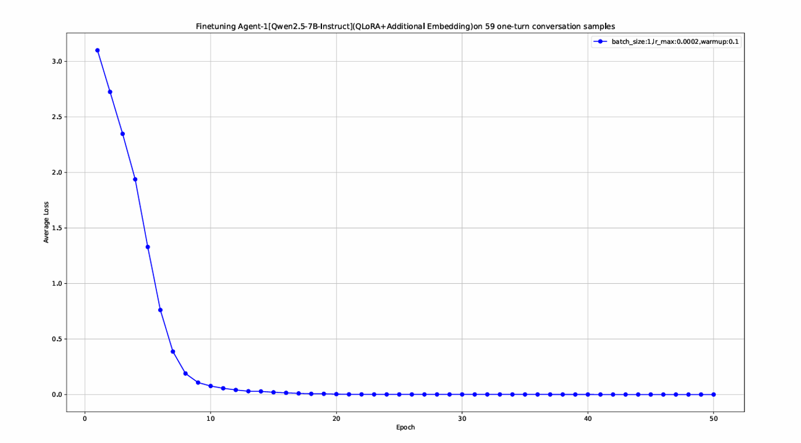
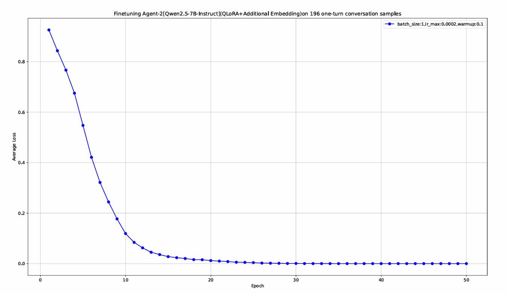

## "农心向荣"创作平台项目说明

## 运行说明

### 环境配置

*环境启动须知：需要先从https://repo.anaconda.com/miniconda/Miniconda3-latest-Windows-x86_64.exe下载Anaconda3安装程序，Anaconda是项目依赖库管理工具。* 


1. ```
   conda create -n fhfp_video_assist python=3.9 -y
   ```

2. ```
   conda activate fhfp_video_assist
   ```

3. ```
   进入你的项目目录并根据依赖文件安装第三方库
   pip install -r requirements.txt
   ```

4. ```python
   运行后端测试环境脚本
   python backend/main_with_empty_model_v2.py
   
   
   运行后端生产环境（接入双智能体大模型推理）脚本（需要20GB以上显存（含专用和共享））
   python backend/main.py
   
   
   scene_model_id='Qwen/Qwen2.5-7B-Instruct'
   org_scene_model_path='E:/LLMs/Scene_Qwen2.5-7B-Instruct'
   # scene_merged_dir="./scene_agent_merged"
   SCENE_LORA_DIR="./scene-lora"
   SCENE_MODE_EMBED_DIR="./scene-mode-embed"
   
   abstract_model_id='Qwen/Qwen2.5-7B-Instruct'
   org_abstract_model_path='E:/LLMs/Abstract_Qwen2.5-7B-Instruct'
   # abstract_merged_dir="./abstract_agent_merged"
   ABSTRACT_LORA_DIR="./abstract-lora"
   ABSTRACT_MODE_EMBED_DIR="./abstract-mode-embed"
   
   
   quantization_config = BitsAndBytesConfig(
      load_in_4bit=True,
      bnb_4bit_use_double_quant=True,
      bnb_4bit_quant_type="nf4",
      bnb_4bit_compute_dtype=torch.bfloat16,
   )
   
   
   """
   # 第一次需要从transformers拉取Qwen2.5-7B-Instruct(双智能体共同基座模型)
   # 如果网速较慢，需要配置镜像或者代理，镜像配置不一定成功，建议使用代理连接
   import os
   os.environ["HF_ENDPOINT"] = "https://hf-mirror.com"
   
   # 如果显卡可以安装flash-attn,可以把eager(sdpa)改成flash_attention_2
   base_model = AutoModelForCausalLM.from_pretrained(
      pretrained_model_name_or_path=scene_model_id,
      quantization_config=quantization_config,
      device_map="cuda",
      attn_implementation="eager",
      local_files_only=False,
   )
   """
   
   # 后续部署模型直接使用本地模型路径(因为基座是一致的，两个智能体可以共享基座，如果需要全量微调就要把基座分开)
   base_model = AutoModelForCausalLM.from_pretrained(
      pretrained_model_name_or_path=org_scene_model_path,
      quantization_config=quantization_config,
      device_map="cuda",
      attn_implementation="eager",
      local_files_only=True,
   )
   
   ```

6. ```
   运行前端脚本（自动弹出网页）
   python frontend/main_kimi_v3.py
   ```


### flash-attn依赖库安装说明
`pip install flash-attn --no-build-isolation`

*注意：FlashAttention 需要 CUDA 编译，安装时间较长，且只支持 NVIDIA Ampere (A100/RTX 30xx)、Ada (RTX 40xx)、Hopper (H100) 架构。*


### 补充说明

如果网页没有弹开，在浏览器里面输入http://127.0.0.1:3000即可访问网页端,NiceGUI接口还提供公网访问链接(在控制台的第二个链接的位置)，移动设备或者其他电脑可以输入访问


## 项目介绍

### 面向群体


### 痛点分析


### 项目规划-甘特图


### 项目功能-流程图


### 数据集构建

\- Layer 2 (Clip-level Description): Call Qwen3.5-Omni-Plus on DashScope. Take sampled frames, audio and system prompts as input, and output standardized JSON-format clip descriptions including `scene`, `audio` and `text` fields. We restrict the maximum output tokens and adjust sampling parameters to control content length and format compliance. To reduce API costs, only text output is enabled.

\- Layer 1 (Video-level Summary): Concatenate all Layer 2 clip descriptions of one video, and input the combined text into Qwen3-VL-Plus (pure text mode) to generate a video summary within 500 words, covering main characters, events, scenes and themes.

\- Layer 0 (Highlight Extraction): Manually extract key phrases (50-150 words) from Layer 1 summaries for Agent 1 fine-tuning. A total of 59 qualified annotated data samples are available for Agent 1 due to manual workload constraints.


### 模型微调/推理WorkFlow

#### Model Selection and Quantization Configuration

We select Qwen2.5-7B-Instruct as the base model, which has powerful Chinese comprehension and generation capabilities and supports a long context window of 128K tokens. To deploy and run the model on consumer-grade NVIDIA RTX 5070 (12GB VRAM), 


we adopt NF4 (4-bit Normal Float) quantization combined with double quantization. After quantization, the model occupies only 5-6GB VRAM, leaving sufficient resources for QLoRA fine-tuning.

#### Fine-tuning Settings and Training Details

1. QLoRA Configuration: LoRA rank is set to 16, alpha scaling factor to 32, target modules include attention projection layers and feed-forward network layers, dropout rate is 0.05. AdamW optimizer with a learning rate of 2e-4 is adopted, combined with linear warm-up and cosine annealing learning rate scheduling.


2. Dual-mode Embedding Layer: An additional trainable mode tag embedding layer is added on top of the original embedding layer to distinguish the two operating modes (product introduction / story creation). A scaling factor is set to control the impact of mode embedding on the original semantic representation to avoid semantic confusion.


<center>
  
</center

<center>
  
</center


### Dual-Agent Inference Workflow

#### Agent 1: Highlight Extraction and Summary Generation

The workflow is divided into two stages:

1. Highlight Extraction: With dedicated system prompts, the AI conducts multi-round interactive conversations with users to dig out key highlights of products or stories. After users confirm the conversation, the model outputs key highlights in phrase format (50-150 words).


2. Summary Generation: Take the extracted highlights as input, and generate a complete video text summary (around 500 words) following corresponding system prompts.


#### Agent 2: Clip Description Generation

Take the text summary generated by Agent 1 as input, and generate standardized JSON-format shot guidelines according to system prompts. Each JSON object contains three parts: scene description, audio description and character lines (a list of objects including character name and lines).


## 项目（实机）视频

(1) 演示[含移动端/PC端]：https://www.bilibili.com/video/BV1cMjq6nEf5/?vd_source=042f7eb039218f092216ee53fc47d873

(2) 讲解：https://www.bilibili.com/video/BV1pNjq6pEWp/?vd_source=042f7eb039218f092216ee53fc47d873

